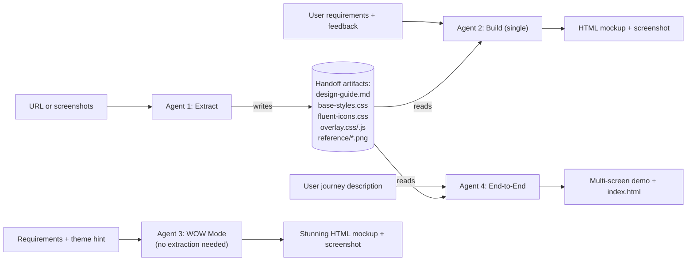

# Architecture

## System Design

Mockup Builder is a four-agent system. Agent 1 (extraction) and Agents 2 & 4 (building) are decoupled through a file-based handoff contract. Agent 3 (WOW Mode) operates independently — no extraction step required.



Plain-text fallback for viewers without Mermaid:

```
URL/screenshots ──► Agent 1: Extract ──► design-guide.md, base-styles.css,
                                          fluent-icons.css, overlay.css/.js,
                                          reference/*.png
                                                  │
                                                  ├──► Agent 2: Build (single) ──► HTML mockup
                                                  └──► Agent 4: End-to-End ──► Multi-screen demo

Requirements + theme hint ──► Agent 3: WOW Mode ──► Stunning HTML mockup
                              (no extraction needed)
```

### Why files, not API calls?

1. **Human-editable**: you can manually tweak the design guide before generating mockups.
2. **Debuggable**: if a mockup looks wrong, check the guide — the problem is always in one of two places.
3. **Reusable**: the CSS works outside this system — drop it into any project.
4. **Agent-agnostic**: any AI that reads markdown and writes HTML can be Agent 2 or Agent 3.

## Agent 1: Design Extraction

### Playwright workflow

```
navigate(url)
  → screenshot (full page)
  → snapshot (accessibility tree → understand structure)
  → evaluate(getComputedStyle) on:
      - body, header, nav, buttons, inputs, headings, tabs, tables
  → click interactive elements (list items, buttons that open dialogs)
      → screenshot each state
      → extract dialog/modal styles
  → find iframes → enter frame → repeat extraction
  → convert rgb() → hex
  → write design-guide.md
  → write base-styles.css
```

### Iframe handling

Many enterprise apps (Power BI, Fabric, Azure Portal) use nested iframes. The extraction agent handles this via:

```js
// Method 1: Playwright frame API
const frame = page.frames().find(f => f.url().includes('target'));
await frame.evaluate(() => { /* extract styles */ });

// Method 2: MCP ref-based access (crosses iframe boundaries)
// Use element refs from browser_snapshot which already resolve into iframes
```

### Style extraction targets

| Element selector          | What we extract                              |
|---------------------------|----------------------------------------------|
| `body`                    | Font family, base size, background color     |
| `[role="banner"]`         | Header height, bg, text color                |
| `[role="navigation"]`     | Sidebar width, bg, item styles               |
| `button`                  | All button variants (bg, color, radius, padding) |
| `[role="dialog"]`         | Dialog bg, radius, shadow, padding           |
| `[role="tab"]`            | Active/inactive tab styles                   |
| `th`, `td`, `[role="row"]`| Table header/cell/row styles                |
| `input`, `[role="textbox"]`| Input border, radius, height, font          |
| `h1`–`h6`                | Heading hierarchy (size, weight, color)      |

## Agent 2: Mockup Builder (Single-Page)

### Build workflow

```
ask design-discovery questions (≤3) + offer one proactive suggestion
  → translate informal language → design vocabulary
read design-guide.md
  → understand color palette, typography, spacing
read base-styles.css
  → know available CSS classes
receive user requirements
  → choose layout template
  → compose page with existing CSS classes
  → add realistic placeholder data
  → inject Design Vocabulary Overlay snippet
  → write mockups/<name>.html
  → start http-server (if not running)
  → navigate Playwright to localhost
  → screenshot → show to user + "Show Labels" tip
  → iterate on feedback (translate → edit → re-screenshot → show + name change)
```

### Design Vocabulary Overlay

Every mockup includes a floating **"Show Labels"** toggle (bottom-right corner). When activated it:

1. Scans the DOM for all known component classes and ARIA roles
2. Stamps each element with a `data-dv` attribute containing its design system name
3. Renders a small chip label and dashed outline on each labelled element via CSS `::before`
4. Shows a one-time legend panel explaining how to use the names in feedback

This closes the vocabulary gap: users who don't know design terminology can click the toggle, read the labels, and give precise feedback like "change the `.btn-primary` to `.btn-secondary`" instead of "make the blue button look less important".

### HTML output constraints

- Self-contained: each mockup is one HTML file + shared CSS
- No build step: opens in any browser directly
- No frameworks: vanilla HTML/CSS only
- Semantic: uses proper HTML5 elements and ARIA roles
- Accessible: proper contrast, focus indicators
- Responsive: flexbox/grid, works at 1440px and 1024px


## Agent 3: WOW Mode

### Design-first workflow

```
receive user requirements + optional theme hint
  → pick color palette (Aurora Dark / Sunrise / Ocean / Forest / etc.)
  → pick typography pair (Google Fonts)
  → pick layout archetype (bento grid / split hero / sidebar-nav / etc.)
  → announce choices in one sentence
  → write single self-contained HTML file with all CSS inline
      - CSS custom properties in :root
      - entrance animations (fadeUp, slideIn)
      - gradient / glassmorphism components
      - realistic domain-specific placeholder data
  → save to mockups/<name>-wow.html
  → start http-server (if not running)
  → screenshot → show to user
  → iterate on feedback
```

### What makes WOW different from Build

| Aspect | Agent 2: Build | Agent 3: WOW |
|--------|---------------|--------------|
| Design source | Extracted from existing app | Invented from first principles |
| Color palette | Matches target app exactly | Award-worthy signature palette |
| Typography | Matches target app | Google Fonts — expressive and modern |
| Animations | Minimal (hover transitions) | Entrance animations, shimmer, micro-interactions |
| Layout | Faithful to extracted templates | Innovative (bento, floating nav, split hero) |
| Cards | Plain or lightly styled | Glassmorphism, layered shadows, glow |
| Delight | Realistic data + hover states | Keyboard shortcuts, presence indicators, progress glows |
| CSS architecture | References `base-styles.css` | Fully self-contained `:root` custom properties |

### WOW HTML output constraints

- All CSS in `<style>` block (+ Google Fonts `<link>` allowed)
- No external framework dependencies
- Responsive via `clamp()`, flexbox, and CSS grid
- WCAG AA contrast minimum
- Minimal vanilla JS only when needed (tabs, modals, toggles)

## Agent 4: End-to-End Demo Builder

### End-to-end build workflow

> ⚠️ This mode warns the user upfront and waits for confirmation — it builds significantly longer than a single-page mockup.

```
warn user → wait for confirmation
  → read design-guide.md + base-styles.css
  → receive user journey description
  → plan Screen Inventory (all screens + branch states)
  → present Screen Inventory → wait for approval
  → for each screen:
      → write mockups/<name>.html
      → add navigation links to sibling screens
      → add inline JavaScript for modals / confirmations / form submissions
      → use consistent placeholder data across all screens
      → screenshot → save to mockups/screenshots/<name>.png
  → write mockups/index.html (launch pad with thumbnails + flow diagram)
  → screenshot index → show all screenshots to user
  → iterate (journey-level: add screens / screen-level: edit one file)
```

### Multi-screen output structure

```
<demo-name>/mockups/
├── index.html                   ← Demo launch pad (thumbnails + flow)
├── list.html                    ← Entity list view
├── detail.html                  ← Detail / edit form
├── detail--delete-confirm.html  ← Delete confirmation overlay
├── detail--success.html         ← Post-save success state
└── screenshots/
    ├── index.png
    ├── list.png
    ├── detail.png
    ├── detail--delete-confirm.png
    └── detail--success.png
```

### Key differences between builder agents

| Concern              | Agent 2 (single)          | Agent 3 (WOW)                               | Agent 4 (end-to-end)                        |
|----------------------|---------------------------|---------------------------------------------|---------------------------------------------|
| Design source        | Extracted design system   | Invented from first principles              | Extracted design system                     |
| Output files         | One HTML file             | One HTML file (self-contained)              | Multiple HTML files + index.html            |
| JavaScript           | Minimal / none            | Minimal (tabs, modals, toggles)             | Inline JS for nav, modals, form redirects   |
| Placeholder data     | Per-screen                | Domain-specific, realistic                  | Consistent dataset across all screens       |
| Planning phase       | None                      | Announces palette/layout choice             | Screen Inventory → user approval            |
| Build time           | ~30 s per small change    | ~30 s per small change                      | Several minutes for full journey            |
| Iteration            | Page-level                | Page-level                                  | Journey-level or screen-level               |

## Output directory structure

Every demo lives in its own self-contained folder at the workspace root. The folder name is whatever the user provided (kebab-case, e.g. `business-rules`, `entity-type-view`). All four agents read from and write into the same `<demo-name>/` folder so the whole thing zips and ships as one unit.

```
<demo-name>/
├── design-guide.md          ← Agent 1 output (human-readable design system)
├── base-styles.css          ← Agent 1 output (CSS custom properties + classes)
├── fluent-icons.css         ← Agent 1 output (CSS mask-image icon system, when applicable)
├── overlay.css              ← seeded from skills/_shared/overlay/ — used by Agents 2 & 4
├── overlay.js               ← seeded from skills/_shared/overlay/ — used by Agents 2 & 4
├── reference/               ← (optional) Agent 1 output: screenshots from live app
│   ├── home.png
│   └── detail.png
└── mockups/                 ← Agent 2 / 3 / 4 output (HTML mockup files)
    ├── settings-page.html       ← Agent 2: single-page mockup (extracted design)
    ├── dashboard-v2.html        ← Agent 2
    ├── dashboard-wow.html       ← Agent 3: WOW mode (invented design)
    ├── index.html               ← Agent 4: demo launch pad
    ├── list.html                ← Agent 4: multi-screen demo files
    ├── detail.html              ← Agent 4
    ├── detail--delete-confirm.html  ← Agent 4
    ├── detail--success.html     ← Agent 4
    ├── screenshots/             ← (optional) Playwright screenshots
    │   ├── settings-page.png
    │   ├── dashboard-wow.png
    │   ├── index.png
    │   └── list.png
    └── tools/                   ← (optional) helper scripts (e.g. Playwright screenshot scripts)
```

`reference/`, `mockups/screenshots/`, and `mockups/tools/` are generated as needed and aren't required for the demo to work.

## Extensibility

### Custom agents

The skills are Copilot-compatible markdown prompts. They work with:
- GitHub Copilot CLI
- VS Code Copilot Chat (via `/skills`)
- Any agent framework that reads markdown system prompts

### Multiple design systems

Run extraction against different apps into separate directories. Agent 2 reads whichever directory you point it to.

### Integration with CI/CD

The extraction could be automated in a pipeline:
1. Scheduled Playwright run against staging
2. Produces updated design-guide.md
3. PR with visual diff if tokens changed
